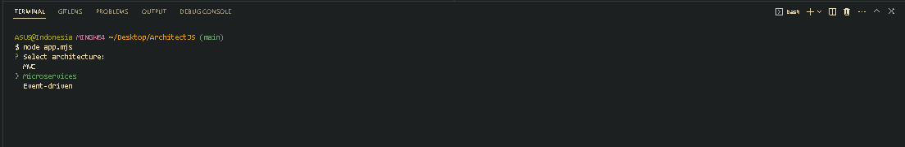
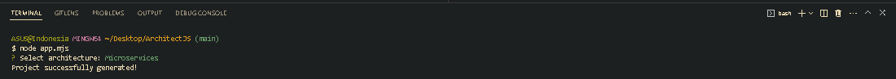
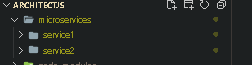

# ArchitectJS

A console application to generate projects for popular architectures using Node.js

1. Installation

```
Star and Clone the repository
```

2. Install the dependencies:

```
cd ArchitectJS
npm install
```

3. Run the following command to start the program:

```
npm start
```

<p>
You get result like this, select your architecture
</p>



<p> Congratulations! You get your project architecture
</p>



<p>Project architecture</p>


